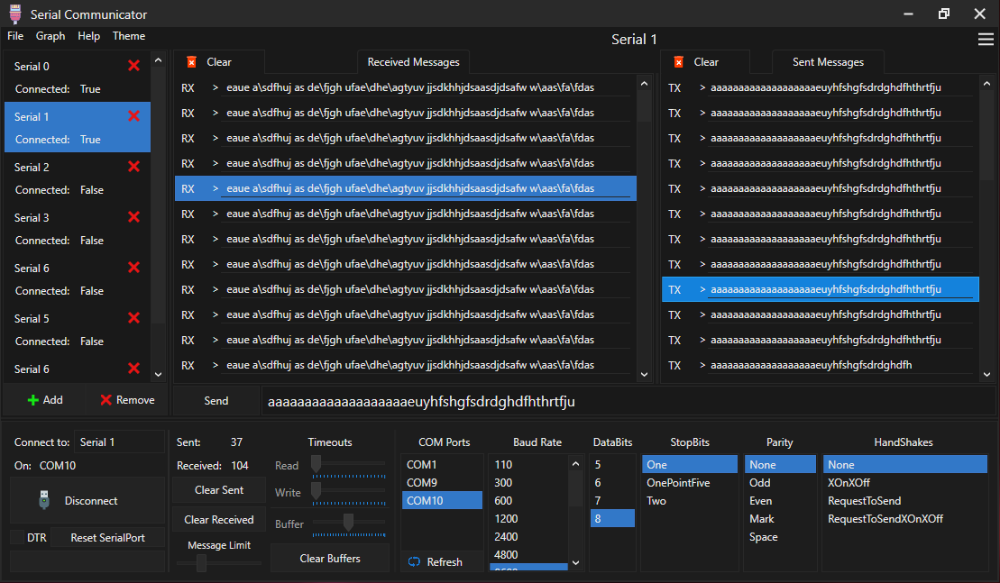

# SerialCommunicator
A program that allows you to communicate via serial ports, such as USB. It has tabs on the left, 
so multiple connections can be made at once. It uses C#'s build in SerialPort library, so it isn't great. 
Planning on building my own SerialPort library, but that might not actually happen. also has a built in graph.
### Info
Messages are inserted at the top, so the order is bottom to top. 
And, the graph uses the charater alphabetical position of received messages to calculate where to point data. idk why i added that. but if the data is only numbers, they get plotted into the graph with their numerical value (e.g, if you receive 29, the graph will plot 29 on the Y axis). The graph is Time based, so X moves with time. 

also, it uses the graphs from this project: https://github.com/royben/RealTimeGraphX
